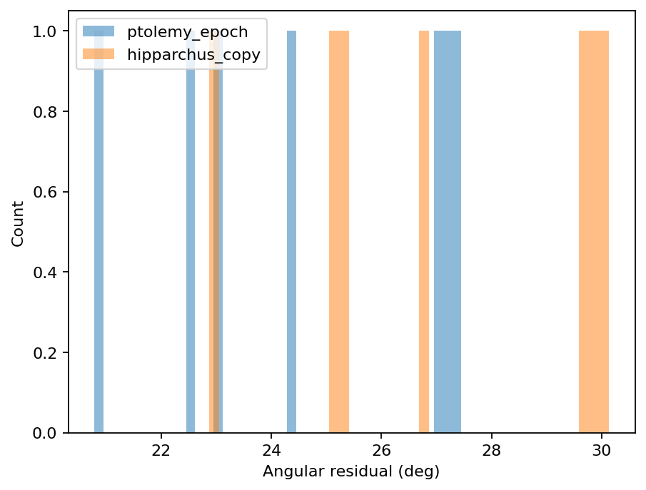
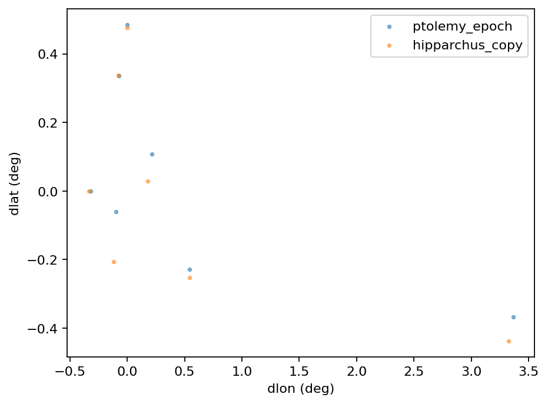

# LOGOS Astro Navigator Report

Run key: `epoch_compare_9e5b2cd2e33a6851`

Config: `"{\"limit\": null, \"catalog_key\": \"almagest_ptolemy\", \"sigma_arcmin\": 20.0, \"epoch_ptolemy\": 137, \"hip_shift_deg\": 2.6666667, \"rounding_arcmin\": 10.0, \"epoch_hipparchus\": -128, \"constellation_shrinkage\": 10.0}"`

## Model summary

- Catalog: `almagest_ptolemy`

- Entries analyzed: **7**

- Mixture weight (Hipparchus-copy): **0.001**

- BIC: Ptolemy=110.2, Hipparchus=113.0, Mixture=114.1

- log Bayes factor (mixture vs best single): **-1.95**

## Figures

